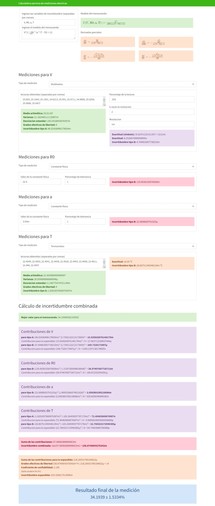

# Calculadora de incertidumbres

Esta calculadora permite determinar las incertidumbres tipo A y tipo B para la materia de mediciones eléctricas en ingeniería eléctrica para facilitar
los cálculos en los exámenes parciales, proyectos y prácticas del semestre

[Calculadora de incertidumbres (competent-newton-410dff.netlify.app)](https://competent-newton-410dff.netlify.app/)

Desarrollado por

- Basurto Sosa José Luis
- Cortés Rodríguez Nolberto
- Parra García Axel Valentín
- Pintor Olivares Luis M

## Captura de pantalla

